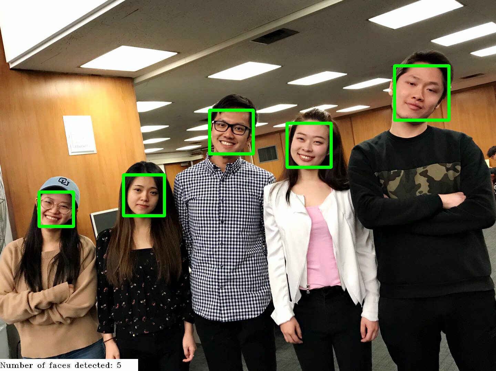
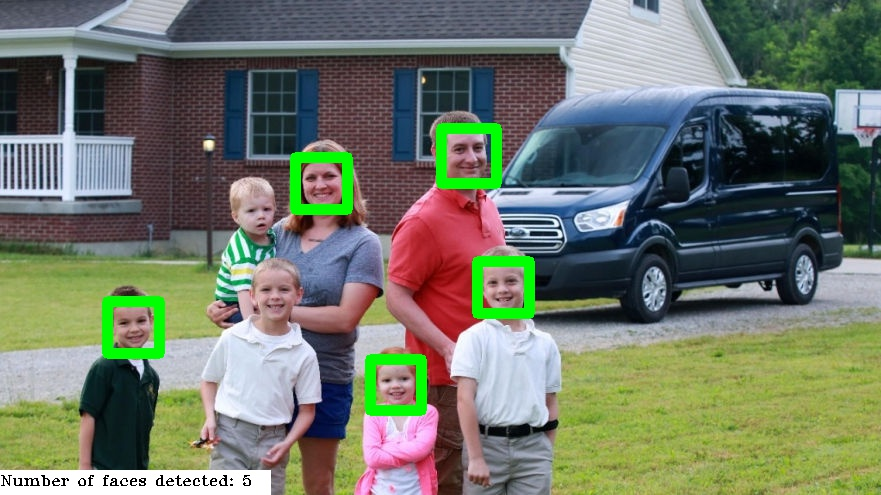
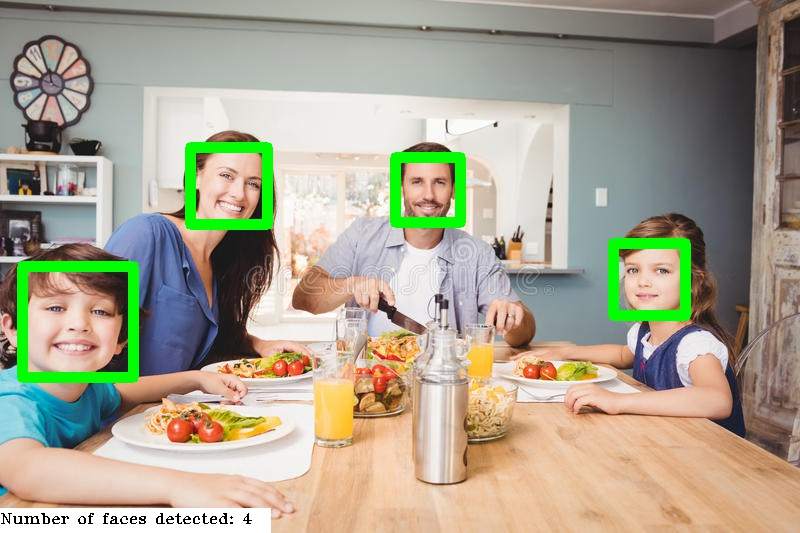
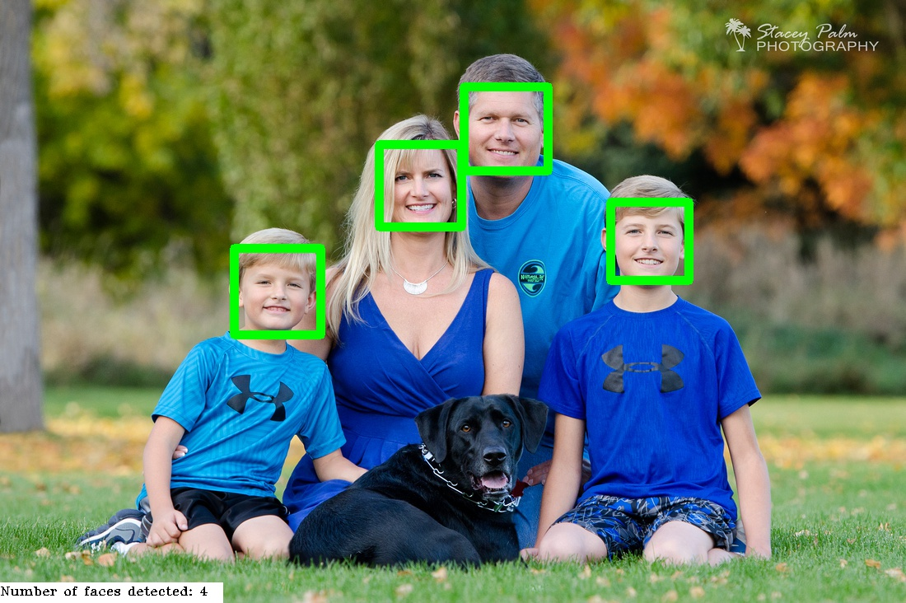
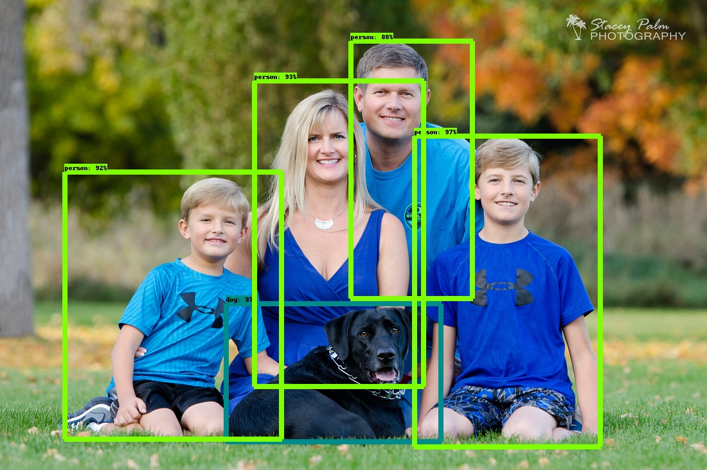
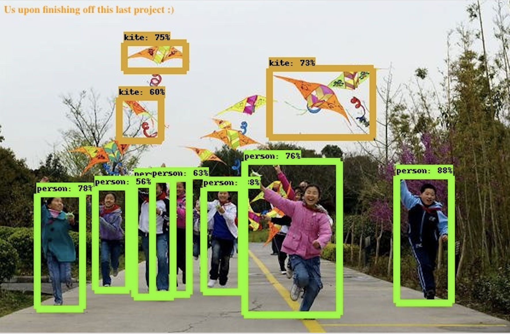

# ADS Project 5: Face and Object Detection

**Projec title**: Face Detection

+ Term: Spring 2018
+ Team members:
	+ Lam, Leo (lkl2129@columbia.edu)
	+ Chen, Ziyu (zc2393@columbia.edu)
	+ Cui, Wanting (wc2619@columbia.edu)
	+ Kong, Yuehan (yk2756@columbia.edu)
	+ Zha, Yuhan (yz3284@columbia.edu)
+ Project summary: Everyday actions are increasingly being handled electronically, instead of pencil and paper or face to face. This growth in electronic transactions results in great demand for fast and accurate user detection and identification. In this project, we aim to construct a face detection model that can accurately detect and count the faces on both images and WebCam. We used a method haar to extract features. After that, by applying extracted features to cascade method, we are able to dectect people's faces and also count the number of faces through pictures as well as webcam. Finally, we implement the contemporary model which can distinguish people as well as objects with confidence value through pictures and real-time webcam.
+ Project Challenge: The first cascade model could not detect rotated faces. To encounter such limitation, we modified our model so that it could detect rotated faces. The second cascade model could solve the rotation problem but could not detect side faces. To overcome such limitations, a popular and powerful approach is the use of tensorflow. In this section, we implement object detection with a pretrained model, Tensorflow Object Detection API. This model requires intallation of tensorflow. Further instruction of the installation can be referred to https://github.com/tensorflow/models/tree/master/research/object_detection. This model can detect and categorize object, including person, bottle, cellphone, etc. However, cascada model would result better if only faces are showed on an image while this API model would result better if more parts of human body are showed. 

+ [main.ipynb](doc/main.ipynb)
+ A main reproducible [HTML page](https://rawgit.com/TZstatsADS/Spring2018-Project5-grp_9/master/doc/main.html)
+ [Presentation](https://github.com/TZstatsADS/Spring2018-Project5-grp9/blob/master/Group9%20presentation.pdf)

# **Result demonstration**


As showed above, our cascade model can accurately detect rotated faces.


## **Face detection and counting based on Cascade method:**



  


## **Object detection based on CNN using TensorFlow:**



 
 


**The more exciting part of this project is the object detection using real time webcam based on either cascade and TensorFlow. You can refer to [main](doc/main.ipynb) for more details. Please note that we suggest clone/download the whole repository so that you can to reproduce the results easily through [main](doc/main.ipynb).**

**Note that you may need to set the working directory to "[doc](doc)" folder by hand before you start reproduce the results, if not by default. Otherwise, you may run into some directory issues.**

	
**Contribution statement**: Generally we did the project together during our meetings (implement face detection model and API).
+ Chen, Ziyu: Built the original model; implemented tensorflow to a contemporary model; debugged and edited the main notebook to make it reproducible and look better.
+ Cui, Wanting: Improved by adding rotate element.  
+ Kong, Yuehan: Tried to improve by adding upper body element; wrote and organized github page.
+ Lam, Leo: Debugged the code; wrote the main notebook.
+ Zha, Yuhan: Researched and introduced tensorflow; prepare the presentation


Following [suggestions](http://nicercode.github.io/blog/2013-04-05-projects/) by [RICH FITZJOHN](http://nicercode.github.io/about/#Team) (@richfitz). This folder is orgarnized as follows.

```
proj/
├── lib/
├── data/
├── doc/
├── figs/
└── output/
```

Please see each subfolder for a README file.
